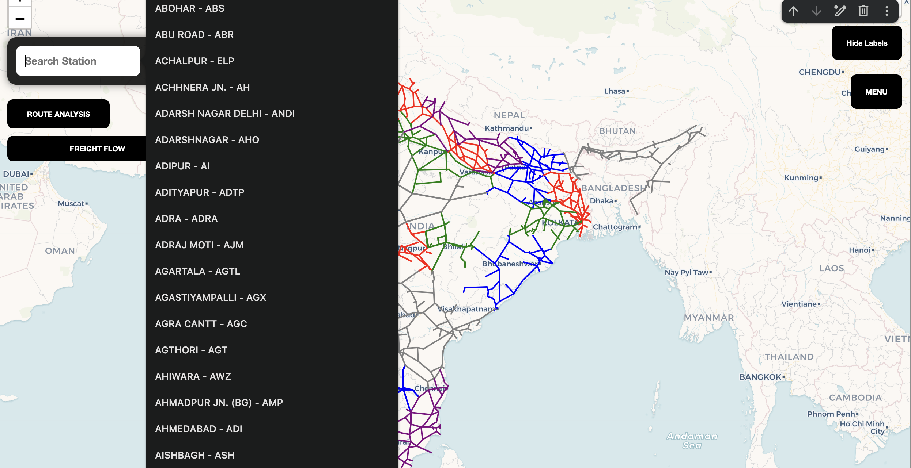
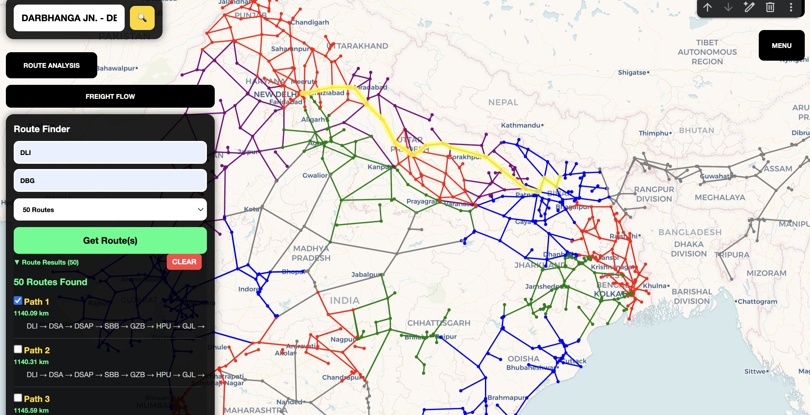
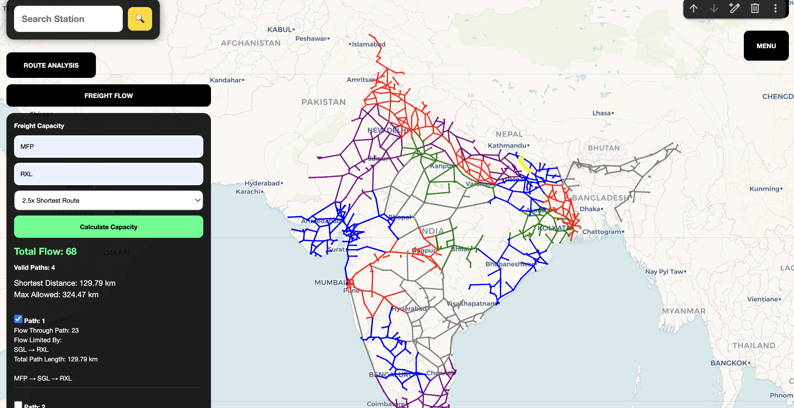
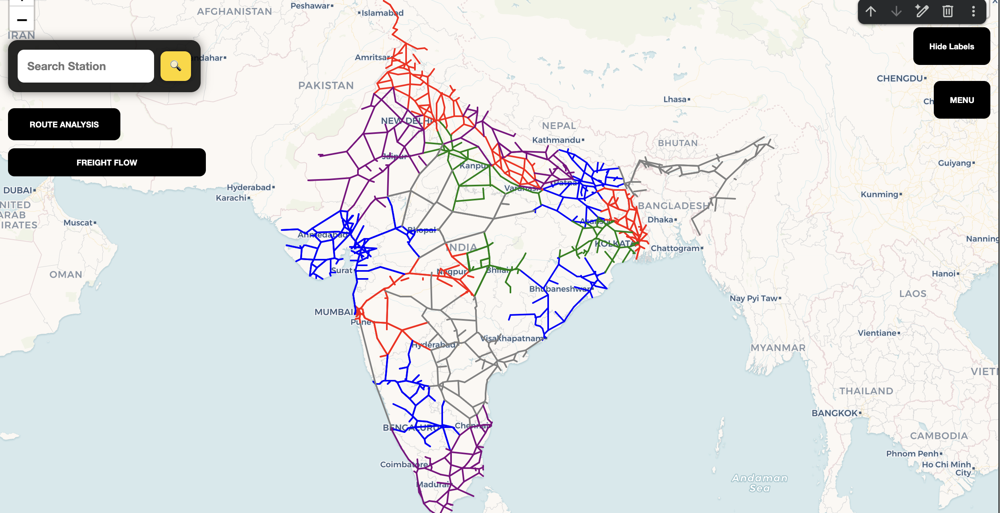
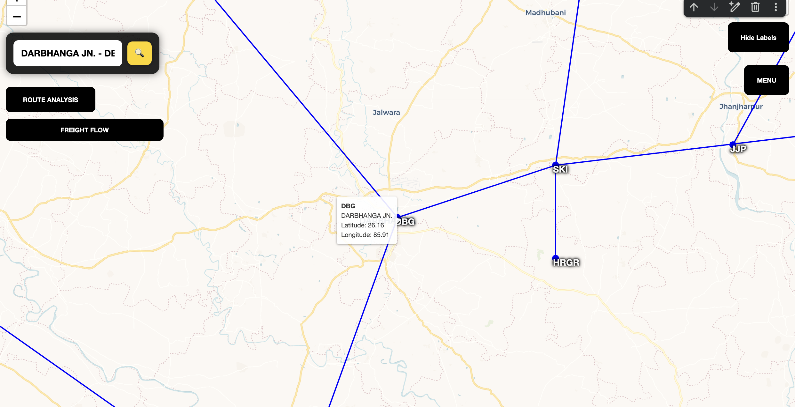
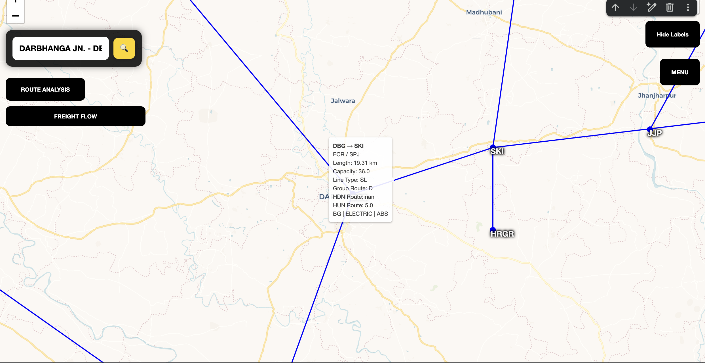
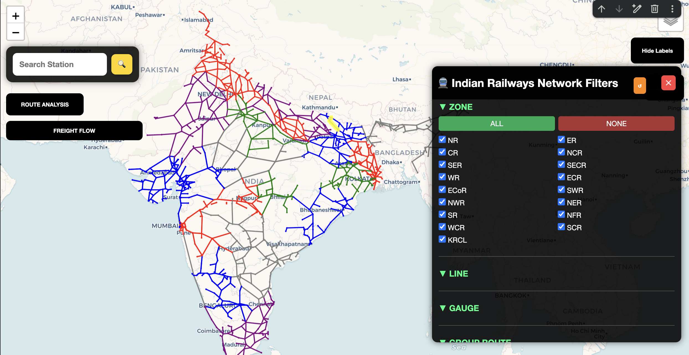

# Railway-Network-Freight-Flow-Analysis-Visualization
Built a GIS-based railway network analysis platform covering 17 railway zones, 69 divisions, 1,285 stations, and 1,447 network connections, enabling alternate route discovery and freight flow estimation using graph algorithms and network optimization.

# Railway Network Freight Flow Analysis & Visualization

A GIS-based railway network analysis platform developed during my internship at the Centre for Railway Information Systems (CRIS) under the Advanced Data Science and Operations Research (ADAOR) Group.

The system models the Indian railway network as a graph and supports route discovery, freight flow estimation, network exploration, and interactive visualization.

## 🎥 Video Demo

[▶ Watch Full Project Demonstration](https://drive.google.com/file/d/1057RTrTfByHpx3hXt2zfXIsF6TqCM90z/view?usp=sharing)

---

## 📊 Network Scale

The platform was built using railway infrastructure data spanning:

* 17 Railway Zones
* 69 Railway Divisions
* 1,285 Stations
* 1,447 Network Connections
* 1,962 Railway Sections

---

## ⚙️ System Overview

The project transforms railway infrastructure records into a graph-based network representation where:

* Stations are represented as graph nodes
* Railway sections are represented as weighted edges
* Route lengths and operational attributes are used for network analysis
* Geospatial coordinates are used for interactive visualization

The resulting system enables users to explore the railway network and evaluate alternate freight movement routes.

---

## 🚉 Key Features

### Station Search

Search stations using station names and station codes.

### Route Analysis

Identify feasible routes between source and destination stations using shortest-path techniques.

### Freight Flow Analysis

Analyze freight movement capability and network connectivity between Origin-Destination (O-D) pairs.

### Interactive GIS Visualization

Visualize the railway network on an interactive map built using Folium.

### Network Exploration

Inspect station and section attributes through interactive node and edge tooltips.

### Route Filtering

Filter the network using operational and infrastructure attributes.

---

## 🛠️ Technology Stack

* Python
* Pandas
* NumPy
* NetworkX
* Folium
* HTML
* CSS
* JavaScript
* Jupyter Notebook

---

## 📈 Graph Analysis Techniques

* Dijkstra's Shortest Path Algorithm
* K-Shortest Path Analysis
* Maximum Flow Based Freight Capacity Estimation
* Network Connectivity Analysis

---

## 🏢 Internship Context

Developed during practical training at:

Centre for Railway Information Systems (CRIS)
Ministry of Railways, Government of India

Under the Advanced Data Science and Operations Research (ADAOR) Group.

---

## Note

Source code and datasets are not included in this repository.

This repository is intended to showcase the project's methodology, visualizations, architecture, and outcomes developed during the internship.

